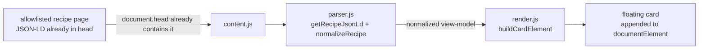

# Agent guide (maintainers & AI assistants)

This document orients anyone (including automated coding agents) who opens this repository so work can continue without rediscovering context.

## Purpose

**Recipe Summarizer** is a Manifest V3 Web Extension for **Firefox and Chromium (desktop)**, with Firefox for Android as a best-effort target. On an allowlisted recipe page it reads the `schema.org/Recipe` JSON-LD block already embedded in that page's own `<head>` — present in the raw server-rendered HTML for every visitor, paywalled or not, because sites ship it for SEO/Google rich-results indexing — and renders it as a small floating card: title, rating, time/yield/category, ingredients checklist, numbered steps.

The parsing/rendering logic is written against the **schema.org spec itself**, not any one site's quirks, so it's largely site-agnostic already — see "Adding a new site" below. Currently allowlisted: NYT Cooking (`cooking.nytimes.com`) and babi.sh (`www.babi.sh`), confirmed against real captured pages from both. Site-specific data-quality quirks (a field NYT always populates that another site omits, an ISO duration expressed differently, a rating with zero reviews) are handled defensively in `parser.js` rather than assumed away — see Roadmap for what's been found so far and what's still a known gap.

Nothing is fetched from anywhere. The content script only reads DOM/JSON-LD the browser already received as part of loading the page. No login, no account interaction, no request the browser wasn't already going to make.

Human-facing overview: [README.md](README.md).

## Naming & scope note

Do not refer to this project by the git repository's literal name — it mischaracterizes what the code does (there is no account or authentication interaction anywhere in this codebase). The public/working name is **Recipe Summarizer**. Distribution is **personal and unpacked-only** by deliberate choice, tied to a legal-risk read-through done before this code was written (DMCA §1201 anti-circumvention is the theory publishers have used against tools that spoof requests to obtain paywalled content the server hadn't sent — this project's mechanism is different: it only re-displays data already delivered to the user's own browser). **Do not add store-packaging or publishing steps without revisiting that legal analysis first.**

## Repository map

| Path | Role |
|------|------|
| [manifest.json](manifest.json) | MV3 manifest: declarative `content_scripts` matching an explicit per-site allowlist (currently `cooking.nytimes.com/recipes/*`, `www.babi.sh/recipes/*` — no `host_permissions` needed for declarative matches), `browser_specific_settings.gecko` for Firefox, minimal `permissions`. No `background` key — there's nothing to do until the content script itself runs on a matching page. |
| [src/common/parser.js](src/common/parser.js) | `getRecipeJsonLd(doc)` finds the `Recipe`-typed `application/ld+json` block; `normalizeRecipe(raw)` maps it to a flat view-model, handling the `HowToStep`-vs-`HowToSection` and ingredient-shape variance. |
| [src/common/duration.js](src/common/duration.js) | `parseIso8601Duration()` / `formatMinutes()` for `totalTime`/`prepTime`/`cookTime`. |
| [src/common/render.js](src/common/render.js) | Builds the card via `createElement`/`textContent` only (never `innerHTML` — see Constraints), wires the collapse toggle, Copy-as-Markdown, and Print actions, persists collapsed state to `storage.local`. |
| [src/common/styles.css](src/common/styles.css) | Card styling + `@media print` rule, declared directly in `manifest.json`'s `content_scripts.css` (see Cross-browser API usage for why this differs from address-quick-display's runtime style injection). |
| [src/content/content.js](src/content/content.js) | Entry point. Idempotent (`window.__rsLoaded` guard). Runs parser → normalize → render once the DOM is ready; stays inert (no card, no error) if no `Recipe` JSON-LD is found. |
| [icons/](icons/) | Toolbar/store icons. Regenerate with `python3 scripts/generate-icons.py` (stdlib-only PNG writer, adapted from address-quick-display's). |

## Architecture (runtime)

Much flatter than address-quick-display's: no background script, no context menu, no message passing, no iframe — everything happens inside the one content script that the manifest statically matches onto allowlisted recipe pages.

## Adding a new site

1. Capture a real sample: View Source (or manual `<head>` copy — both produced byte-identical JSON-LD in testing) on one of the site's recipe pages. Extract the `application/ld+json` block typed `Recipe` and eyeball it against `parser.js`'s `normalizeRecipe()`.
2. Run it through the parser (no browser needed — `normalizeRecipe()` is a pure function, see the manual test approach used for both NYT and babi.sh: load `duration.js`+`parser.js` in plain Node, `JSON.parse` the sample, call `normalizeRecipe(raw)`, eyeball the output). Look specifically for: duration format (seconds vs H/M), whether `aggregateRating` uses `0/0` for "no ratings yet", whether `recipeInstructions`/`recipeIngredient` contain non-recipe noise (section headers, appended metadata) mixed into otherwise-clean fields.
3. Add the site's recipe-page URL pattern to `manifest.json`'s `content_scripts.matches` (keep it path-scoped, e.g. `/recipes/*`, not the whole domain, matching the existing entries).
4. Update the domain list in this section and in `README.md`.
5. Load unpacked and confirm the card renders sanely on a real page from that site.

Known limitation, not chased further: some sites embed section-like headers ("For the Sauce") as plain `HowToStep` entries mixed into a flat instruction array, rather than proper schema.org `HowToSection` grouping (seen on babi.sh). There's no reliable way to detect "this step is actually a heading" without text-pattern heuristics that would misfire on other sites' legitimately short steps — so these render as an oddly-worded numbered step rather than a section header. Accepted as a per-site data-quality gap.

## Settings/storage schema

| Area | Key | Meaning |
|------|-----|---------|
| `storage.local` | `rsCardExpanded` | Boolean — whether the card was left expanded or collapsed, restored on next page load. |

## Cross-browser API usage

Scripts use **`const ext = globalThis.browser ?? globalThis.chrome`** (same idiom as address-quick-display), used only for `ext.storage.local`. The manifest's single `browser_specific_settings.gecko` block (with `data_collection_permissions: {required: ["none"]}`) is read by Firefox and harmlessly ignored by Chrome — no separate per-browser manifest needed.

Deliberate deviation from address-quick-display: that project injects its CSS at runtime via a `<style>` template string because its content script is injected on-demand through `scripting.executeScript` (no static `matches`). This project uses **declarative** `content_scripts` with a static `matches` array, so a normal `"css"` entry in `manifest.json` is simpler and equally namespaced (`rs-` prefix throughout) — there's no on-demand-injection problem here to solve.

No ES modules / no build step: `duration.js` and `parser.js` attach globals (`RS_DURATION`, `RS_PARSER`) that `render.js` and `content.js` read; load order in `manifest.json`'s `content_scripts.js` array matters.

## How to run & test

### Firefox (primary target)

1. `about:debugging#/runtime/this-firefox` → **Load Temporary Add-on…** → select `manifest.json`.
2. Visit a recipe page on any allowlisted site, e.g. `cooking.nytimes.com/recipes/9101-classic-shrimp-scampi` or `www.babi.sh/recipes/*`. The card should appear top-right within a moment of the page settling.
3. Exercise: collapse/expand (reload the page — state should persist), ingredient checkboxes (should visibly check/strikethrough, not render blank), step numbers (should be visible and continuous across any section groupings), Copy as Markdown (paste and check), Print (print preview should show only the card).
4. Temporary add-ons disappear when Firefox closes; reload after code changes.

### Chromium (Chrome / Edge)

1. `chrome://extensions` → Developer mode → **Load unpacked** → repo root.
2. Same smoke test. **Reload** the extension after code changes.

### Firefox for Android (best-effort)

Sideloading a temporary/unpacked add-on onto Firefox for Android generally requires connecting via desktop Firefox's `about:debugging` over USB to a Nightly (or otherwise debug-enabled) build on the device, then **Load Temporary Add-on** targeting the same `manifest.json`. **Verify this against Mozilla's current documentation before relying on it** — the exact sideloading path has moved around across Firefox-for-Android versions and this note may be stale.

### Debugging

- In the page tab console: `sessionStorage.setItem("rs_debug", "1")`, reload, look for `[recipe-summarizer]` logs. Clear with `removeItem`.
- No card and no console output on a recipe-shaped URL usually means the page's JSON-LD didn't parse as `@type: "Recipe"` — check `document.querySelectorAll('script[type="application/ld+json"]')` manually in devtools.
- This is by design inert on any page without `Recipe`-typed JSON-LD — that's not a bug to fix, it's the extension declining to do anything on pages it doesn't understand.

## Constraints (do not regress without intent)

- **Permissions:** stay at `storage, clipboardWrite` and **no `host_permissions`**. The `content_scripts.matches` array is the only host-scoping this extension needs or should ever need.
- **Privacy:** zero network requests originate from this extension — the only "network" involvement is the current page's own HTML that its server already sent the browser before this code ever runs. Nothing is transmitted anywhere, on any allowlisted site.
- **No `innerHTML` on JSON-LD-derived strings:** confirmed from real NYT samples that a site's JSON-LD can contain raw embedded HTML in string fields (review bodies have literal ` `/`<a href>`). Treat every site's JSON-LD as untrusted the same way — every field that *is* rendered goes through `textContent`/`createTextNode` only, regardless of which site it came from. Don't relax this if reviews or other fields are ever added.
- **Payload:** no frameworks, no build step; the repo root loads directly as an unpacked extension in both browsers.

## Roadmap

1. **Verify the `HowToSection` branch in `parser.js` against a real multi-section/sub-recipe page** — none of the samples used to build this parser (NYT or babi.sh) actually use proper `HowToSection` grouping; the sectioned-instructions code path is written from the schema.org spec, not from an observed example. (babi.sh does have multi-part recipes, but represents them as fake-heading `HowToStep` entries instead — see "Adding a new site" above, accepted as a known gap rather than something to detect heuristically.)
2. Optional, not started: rendering `nutrition` and `image` fields (skipped in v1 — text-only card avoids any question about redistributing a site's photography).
3. Optional, not started: surfacing a couple of top `review[]` entries, if ever wanted — would need explicit HTML-stripping given the raw-HTML-in-reviews finding above, not just a `textContent` set on the whole body if any markup should be preserved as formatting rather than stripped.
4. Done: seconds-only ISO-8601 durations (`PT7200S`, seen on babi.sh — `duration.js` previously silently dropped the seconds group), zero-value `aggregateRating` treated as "no rating yet" rather than a real 0/5, and trailing markdown-bullet noise appended to step text (also babi.sh) are all handled generically now, not as site-specific patches — expect more of this class of fix as more sites get added.

## Shipping

This project does **not** have a "package and publish" step, unlike address-quick-display — see Naming & scope note above. Distribution stays unpacked-only. If that ever changes: bump `version` in [manifest.json](manifest.json), but first revisit the DMCA/ToS risk discussion from this project's research phase — publishing (store listing or public repo) is a materially different risk profile than personal local use, and that tradeoff was a deliberate, considered decision, not a default to drift away from.
